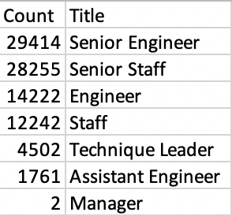
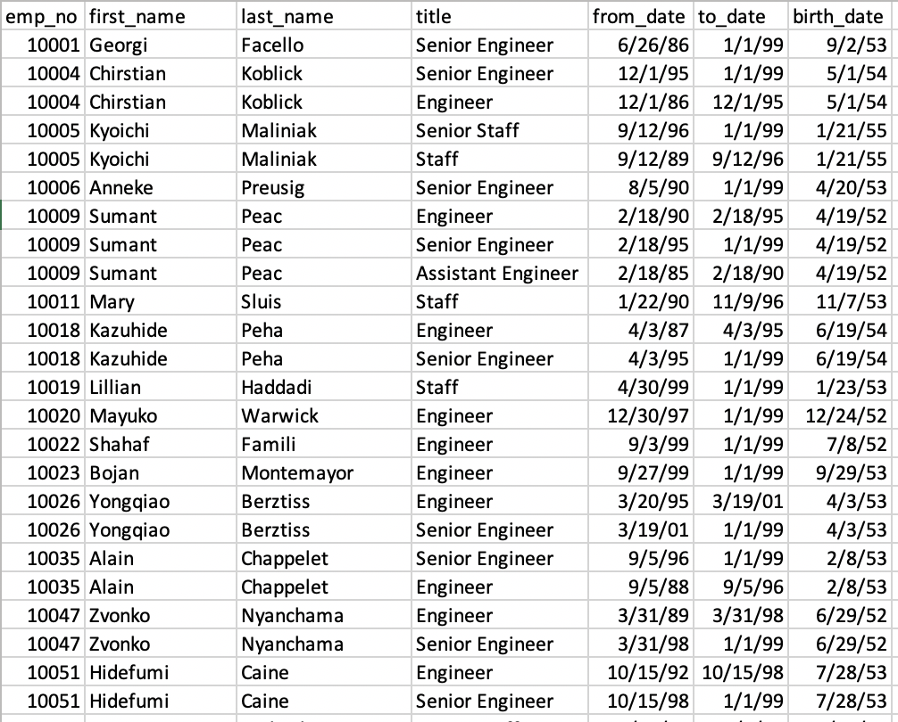
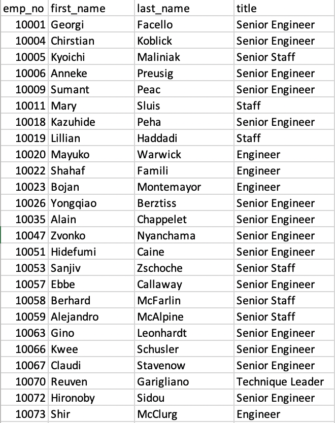
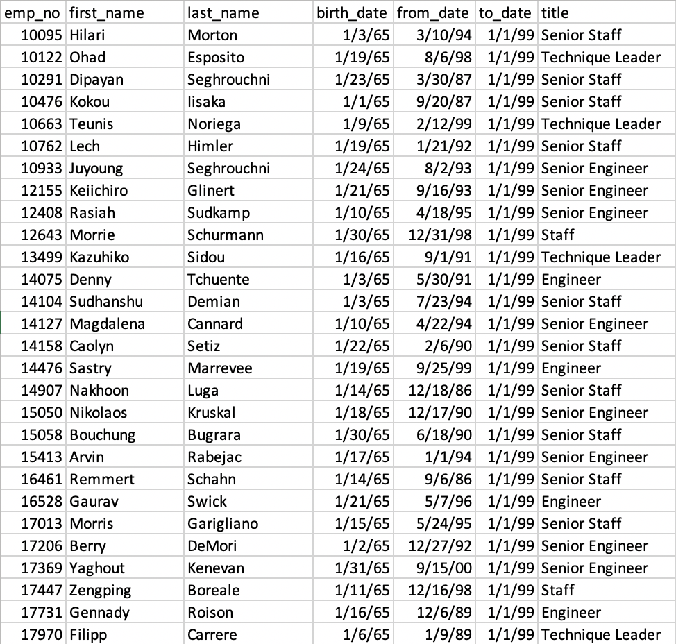
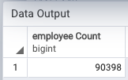
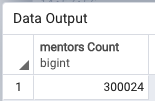

# Pewlett-Hackard-Analysis

##### This analysis will provide understanding of the following fields: number of retiring employees per title, and identify employees who are eligible to participate in a mentorship program. 
---

#### Overview of the analysis: Explain the purpose of this anlaysis. 
  - With postgreSQL's the ability to merge tables, and select distinct employee numbers, our analysis was able to generate tables that contain informative knowledge to the company regarding strategic employees retirement campaign. 
 

#### Results: Provide a bulleted list with four major points from the two analysis deliverables. Use images as support where needed.
  - Image below indicate the number of titles that are retiring. Per table shown below, there are a large amount (29414) of senior engineers who are in our target retirement range. This is followed by senior staff with the number of 28255.
  
  
    
    
  
  - Table retrieves employee information who were norn between 1952 and 1955, and also retrieves their current title. (*Note - there are employees with multiple titles due to promotion.)
  
  
  - Table retrieves employee number, first and last name, and title columns from the previous table. The table will hold the most recent title of each employee.
  

  - The very last table showcases all the employees are qualified for mentorship program. (Conditions are current employees who were born bewtween Jan 1 1965, and Dece 31 1965.)
  

#### Summary: Provide high-level responses to the following questions, then provide two additional queries or talbes that may provide more insight into the upcoming "silver tsunami."
- How many roles will need to be filled as the "silver tsunami" begins to make an impact?
  - The total amount of roles that will need to be filled as the silver tsunami begins to make an impact is 90398.
  - 
- Are there enough qualified, retired-ready employees in the departments to mentor the next generation of Pewlett Hackard employees? 
  - Yes, absolutely. There will be 300024 mentors that will be qualified, retired-ready employees in the departments to mentor the next generation of Pewlett Hackward employees. 
  - 

----
Referefence: Reference: [SQL Documentation](https://www.postgresql.org/docs/9.5/sql-select.html
)
